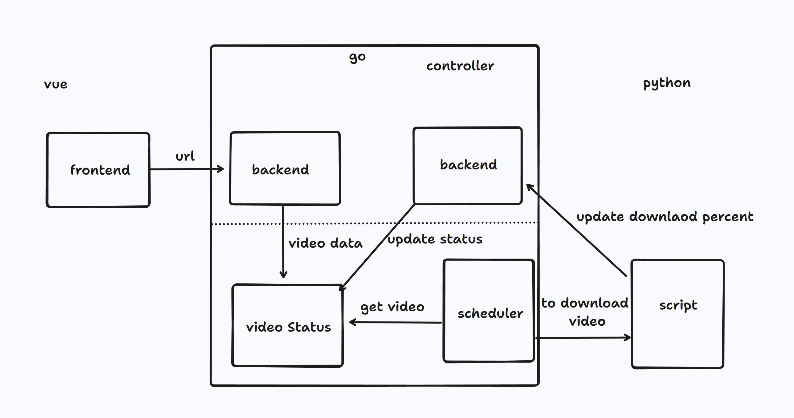

# What is it
it is an application to download youtube and bilibili video with metadata to jellyfin,emby and plex.

# Architecture


# How to Develop
backend:
```
air -c air/.air.toml
```

frontend
```
cd web
pnpm i
pnpm dev
```

# How to use
**Note**: It is not working now
```
docker run -p 7789:7789 -v /usr/local/tools:/usr/local/tools correctroadh/video-tools
```