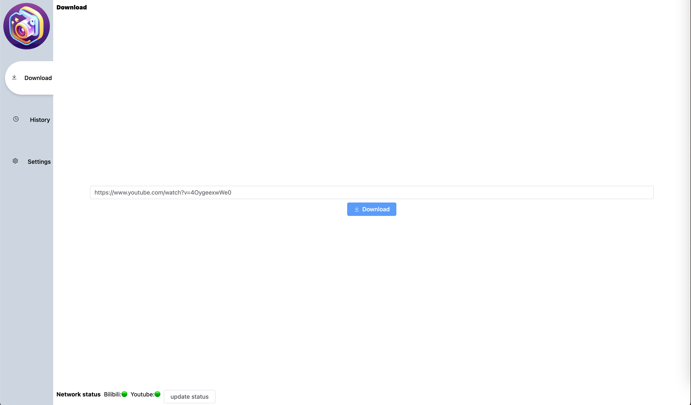

# Media Fetch PRO
</a>

[Documentation](https://github.com/CorrectRoadH/Media-Fetch-Pro/blob/main/documents/document.md) • Live Demo • Discuss in [Discord](https://discord.gg/2WDm9uXZ)

[English](./README.md) | 简体中文


# Media Fetch PRO 是什么
`Media Fetch PRO` 是一个用于下载youtube，bilibili和更多网站的视频的应用程序，将刮削一起下载到jellyfin，emby，plex和更多软件中。



# 文档

[Jellyfin](https://github.com/Media-Fetch-Pro/Media-Fetch-Pro/blob/main/documents/document.md#jellyfin)

[Emby](https://github.com/Media-Fetch-Pro/Media-Fetch-Pro/blob/main/documents/document.md#emby)

[Plex](https://github.com/Media-Fetch-Pro/Media-Fetch-Pro/blob/main/documents/document.md#plex)


# 如何去使用
`./video` 应该替换成你的视频文件夹(在 Jellyfin 中的媒体库). 比如 `/home/user/Videos`.
```
docker run  -itd --name media-fetch-pro -p 7789:7789 -v ./video:/var/opt/video correctroad/media-fetch-pro:latest
```

# Roadmap
 - [x] Support download Youtube Playlist video
 - [ ] Support login by cookie to download hight resolution video
 - [ ] Better Download manager
 - [ ] i18n
 - [ ] Write Documents


# 如何参与开发
backend:
```
air -c air/.air.toml
```

frontend
```
cd web
pnpm i
pnpm dev
```

python
dependencies
```shell
pip install -r requirements.txt
```

fetch video info
```python
python main.py --type fetchVideoInfo --url https://www.youtube.com/watch?v=lyNVPxHiVyE --storage ./video --website youtube
```

test 
```shell
pytest .
```

# Star history
[](https://star-history.com/#Media-Fetch-Pro/Media-Fetch-Pro&Date)
