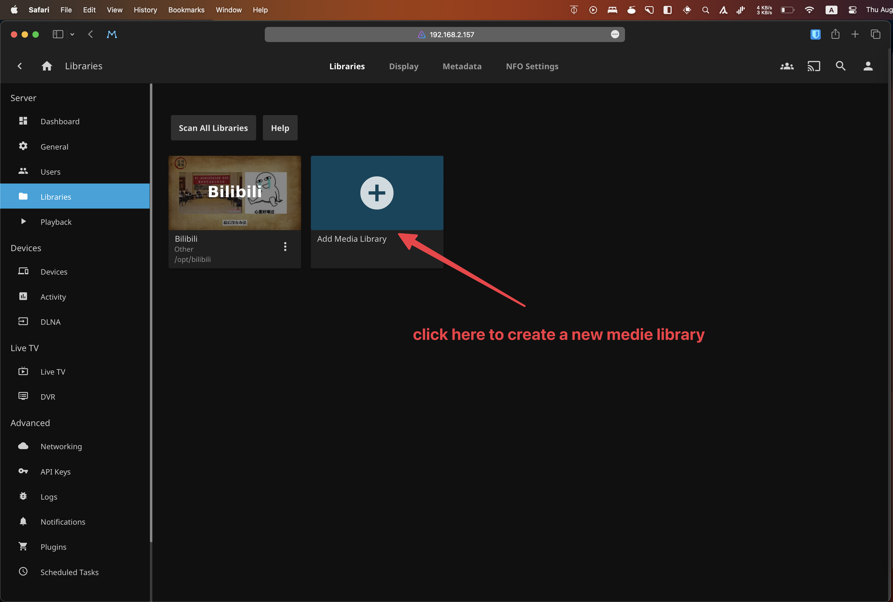
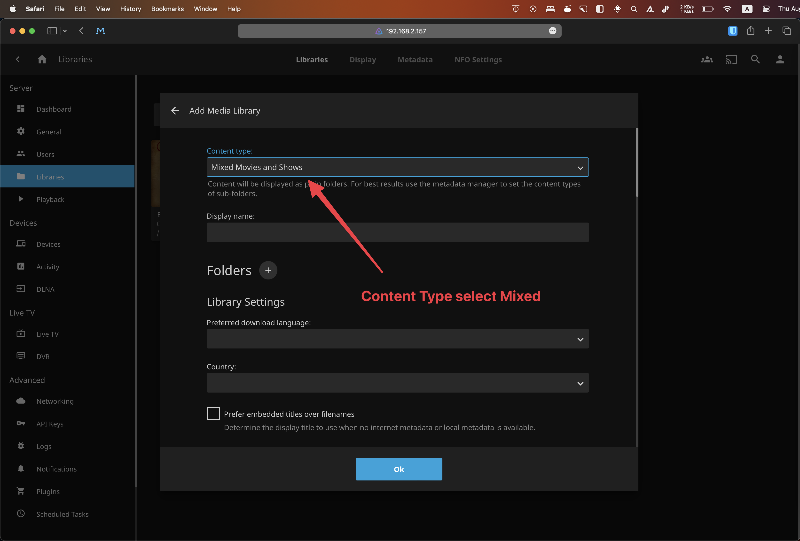

# Install Media Fetch Pro
## docker 

## nas

### install in CasaOS

### install in Synology

# Jellyfin
Create a new library,

select mixed content

select media fetch download path

Click OK

It is done now
# Emby

# Plex